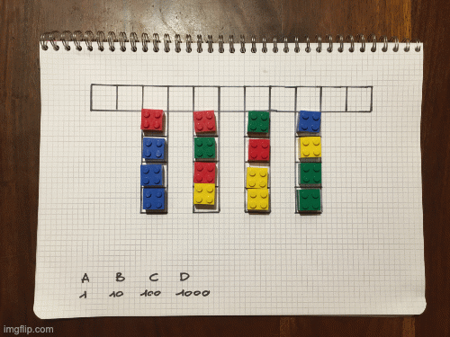

# Advent Of Code 2021

* [Day 1](Day01.ipynb). Simple array manipulation. Using `np.convolve` to implement moving window for Part 2.

* [Day 2](Day02.ipynb). Part 1 with list comprehension. Part 2 quick and dirty with an explicit loop.

* [Day 3](Day03.ipynb). `numpy` FTW, and some poor man bit manipulation (probably useless for Part 1, but I'm happy I took this road for part 2!)

* [Day 4](Day04.ipynb). In principle easy, if only I did not get stuck on part one because I initially forgot to check both rows and column!

* [Day 5](Day05.ipynb). Part 1 simple. Part 2 was obviously introducing diagonals, implementing them required a bit of care to preserve orientation.

* [Day 6](Day06.ipynb). An exponential growth, I better keep track of that population composition!

* [Day 7](Day07.ipynb). I'm sure there are more efficient ways to solve this, but one-liners are always nice!

* [Day 8](Day08.ipynb). Initially solved Part 2 with brute force by checking all possible wiring permutations; when i found a bit of time, implemented a smarter search exploiting segments of unique digits to dramatically reduce search space; finally, coded two procedural solutions that needs no search: first build the wiring pattern (ugly), second directly map patterns to number values (cleaner, and using python `set`).

* [Day 9](Day09.ipynb). Recursive `floodfill` algorithm (learned in 2017 day 14!) to solve Part 2.

* [Day 10](Day10.ipynb). Using a `list` like a stack to store and pop open parentheses.

* [Day 11](Day11.ipynb). First visualisation of a grid evolution.

* [Day 12](Day12.ipynb). First path-finding puzzle of the year, I was (almost) missing them! :-)

* [Day 13](Day13.ipynb). Array broadcasting and `numpy` for folding and overlapping. A timid attempt to OCR the result for Part 2.

* [Day 14](Day14.ipynb)
   * Part 1: simple implementation with a `list`, and a more efficient one with a custom `LinkedList`
   * Part 2: similarly to Day 6, better keep track of the polymer and polymer pair frequencies instead of evolving the full string, since its lenght increases exponentially!
   
* [Day 15](Day15.ipynb): weighted graph shortest path, solved either with `networkx` or my own implementation of the Dijkstra algorithm.

* [Day 16](Day16.ipynb): bit manipulation and recursion!

* [Day 17](Day17.ipynb): weird physics simulation, solved with brute force.

* [Day 18](Day18.ipynb): a quite complex mixture of string manipulation and recursion. It took me quite some time to implement all operations and finish part 1, after that part 2 was trivial.

* [Day 19](Day19.ipynb): Tridimensional geometry treated as matrix algebra.

* [Day 20](Day20.ipynb): a game-of-life on an infinite plane with a spin. Honestly I did not like today puzzle very much, the rules in the full input  that "flipped" the status of all plane looked a bit like a gimmick... 

* [Day 21](Day21.ipynb): Part 1 trivial, Part 2 can be solved with recursion but caching with `lru_cache` is needed not to explode runtime.

* [Day 22](Day22.ipynb):
   * Part 1: quick and dorty solution, that obviously cannot work for part 1 (the "large coordinated" cubes were a clear giveaway!)
   * Part 2: **TODO**

* Day 23: Solved by hand with pen, paper and [LEGO blocks](./visualisation/day23part2.gif), using an [Excel spreasheet](Day23.xlsx) to keep track of movements and sum costs.

  

* [Day 24](Day24.ipynb): Toughest day of the year, it took me many days to work out a solution. After the fact I read on the subreddit one could have simplified even more the computation by _really_ understanding what each instruction block was doing. I am already quite happy with the approach I found (tracking the repetitive `z` register states to significantly reduce the search space, back-navigating the register state tree to build the solution), that BTW allows to find solution of Part 2 for free instantaneously.

* [Day 25](Day25.ipynb): simple list manipulation, but a local copy of previous state was necessary to evolve all elements simultaneously!
